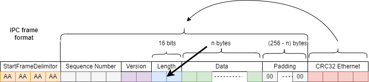
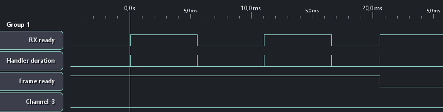
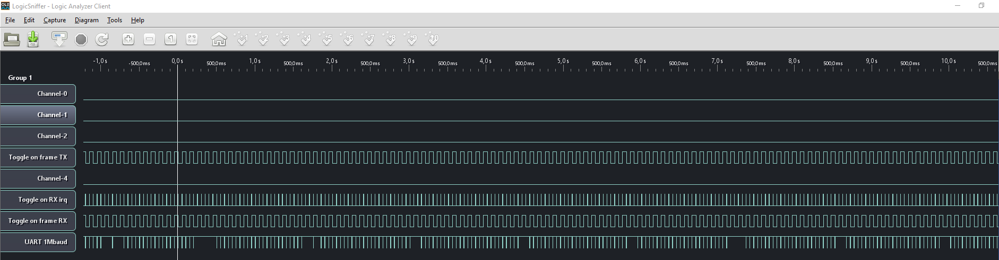

Don't ever use this thing, it was just a bad initiative of me. Please just use others standard reliable protocols (see COBS protocols, SLIP, PPP, ...)

# Zephyr RTOS : IPC protocol over UART module

In this context IPC stands for Inter Processor Communication

The goal of this "module" is to provide a generic IPC over UART protocol implementation for Zephyr RTOS applications which hardware support zephyr UART_ASYNC API.

This module offers an implementation for both RX and TX directions, that can be enabled or disabled independently.

Note: This module requires the polling API `CONFIG_POLL` to be enabled when both directions of the protocol are enabled.

## Configuration options

The `Kconfig` file should be included in your application using the `rsource` directive in the application `Kconfig` file: 
- e.g. `rsource "src/uart_ipc/Kconfig"` at the beginning of the application `Kconfig` file (in application root directory).

| Configuration option            | User assignable | Type   | Default | Description                                                                                                                                 |
| ------------------------------- | --------------- | ------ | ------- | ------------------------------------------------------------------------------------------------------------------------------------------- |
| UART\_IPC                       | no              | bool   | false   | Enable support for IPC over UART.                                                                                                           |
| UART\_IPC\_STACK\_SIZE          | yes             | int    | 512     | Adjust stack size                                                                                                                           |
| UART\_IPC\_FRAME\_BUFFER\_COUNT | yes             | y      | 3       | Adjust internal memslab messages count.<br>\- One for currently being receiving RX frame<br>\- One for being sent TX frame                  |
| UART\_IPC\_DMA\_BUF\_SIZE       | yes             | int    | 68      | Adjust internal DMA RX buffer size, using a low value might cause performance issues,<br>using a high value implies a big memory footprint. |
| UART\_IPC\_DEBUG\_GPIO\_STM32   | yes             | bool   | false   | Enable debugging using GPIO pins on STM32 chips                                                                                             |
| UART\_IPC\_DEBUG\_GPIO\_NRF     | yes             | bool   | false   | Enable debugging using GPIO pins on NRF chips                                                                                               |
| UART\_IPC\_DIR                  | no              | choice | /       | UART IPC direction                                                                                                                          |
| UART\_IPC\_RX                   | yes             | bool   | /       | Enable RX support                                                                                                                           |
| UART\_IPC\_TX                   | yes             | bool   | /       | Enable TX support                                                                                                                           |
| UART\_IPC\_FULL                 | yes             | bool   | /       | Enable RX and TX support                                                                                                                    |
| UART\_IPC\_PING                 | yes             | bool   | no      | Enable ping support for TX direction (implicitely supported for RX)                                                                         |
| UART\_IPC\_PING\_PERIOD         | yes             | int    | 1000    | Ping period in milliseconds (ms)                                                                                                            |
| UART\_IPC\_STATS                | yes             | bool   | no      | Enable stats for the IPC interface (packet loss, etc.)                                                                                      |
| UART\_IPC\_EVENT\_API           | yes             | bool   | no      | Enable event API                                                                                                                            |

## devicetree

This library needs an UART device which support UART_ASYNC API (which is an UART with DMA support).

Configure the `ipc-uart` alias to use the configured UART device :

```devicetree
/ {
        aliases {
		    ipc-uart = &uart7;
        };
};
```

Devicetree overlay for a `nucleo_f429zi` board, using `UART7` :

DMA configuration, read `RM0090` (rev 19) page `307/1751` (DMA1)
- `UART7_TX` is connected to channel 5 stream 1 of the DMA1
- `UART7_RX` is connected to channel 5 stream 3 of the DMA1

```devicetree
&uart7 {
	status = "okay";
	current-speed = < 115200 >;
	// hw-flow-control;
	pinctrl-0 = <&uart7_tx_pe8 &uart7_rx_pe7>;
	dmas =  < &dma1 1 5 0x440 0x3>, /* dma channel stream-slot channel-config features */
		    < &dma1 3 5 0x480 0x3>; 
	dma-names = "tx", "rx";
};
```

Devicetree overlay for a `nrf52840dk` board using `uart1`.

- DMA is already configured

```devicetree
&uart1 {
    status = "okay";
    current-speed = < 115200 >;
    parity = "none";
    // hw-flow-control;
};
```

Ressources:

- [st,stm32-uart](https://docs.zephyrproject.org/latest/build/dts/api/bindings/serial/st,stm32-uart.html)
- [st,stm32-dma](https://docs.zephyrproject.org/latest/build/dts/api/bindings/dma/st,stm32-dma.html)
- [nordic,nrf-uart](https://docs.zephyrproject.org/3.0.0/reference/devicetree/bindings/serial/nordic%2Cnrf-uart.html)
- [nordic,nrf-uarte](https://docs.zephyrproject.org/3.0.0/reference/devicetree/bindings/serial/nordic%2Cnrf-uarte.html)
- [STM32: Improve speed of uart async implementation #34763](https://github.com/zephyrproject-rtos/zephyr/issues/34763)

Notes:
- Clean and rebuild the application when changing the devicetree overlay

## Frame structure

Fixed length frames of 4 + 4 + 4 +256 + 4 = 272 bytes
Frame format:
- 4 bytes: start frame delimitor
- 4 bytes: sequence number
- 2 bytes: frame version
- 2 bytes: length of the frame
- 256 bytes: data
- 4 bytes: CRC



If actual data size is less than 256 bytes, the remaining bytes are filled with padding (`0x00`). Note that the padding bytes are required because of the CRC calculation.

## Frame version

Frame version aims to keep backward compatibility while enriching this application protocol.

Currently supported versions:

- DATA : Standard application frame (256B)
- PING : Standard (default) ping frame (256B)

### CRC calculation

CRC calculation is performed over the sequence number, the data size and the data buffer (actual data + padding `0x00`).

CRC calculation method is the EN/IEC 60335-1 CRC for Ethernet:

- CRC-32 (Ethernet) polynomial: 0x4C11DB7
  - X32 + X26 + X23 + X22 + X16 + X12 + X11 + X10 +X8 + X7 + X5 + X4 + X2 + X + 1

Rationale: The stm32f429zi has a hardware peripheral which performs this exact CRC calculation.

The function `extern uint32_t crc_calculate32(uint32_t *buf, size_t len);` should be implemented externally.

## Sequence number

Sequnce number is incremented by 1 for each frame sent. It can be used to:
- Detect losts frames
- Detect peer reset

It can be used to construct a reliable complexe protocol over it.

## Reference implementations:

These two projects integrate this protocol :
- TX : https://github.com/lucasdietrich/zephyr-nrf52840-ble-dev/tree/ble_xiaomi_mijia_collector
- RX : https://github.com/lucasdietrich/stm32f429zi-caniot-controller


## Debug (using GPIO)

Debug using GPIOs is only support on STM32F4 for now

Expected pins states when receiving a 272B long frame with DMA buffers of size 64B :





## TODO
- **Use buffer allocated from memslab to DMA, instead of using double buffers**
  - This is a great optimization, as we don't need to copy the data from 
  the DMA buffer to the application buffer.
- ~~Propose this "module" as an actual Zephyr RTOS module.~~
- Implementation without the polling API.
- Make the data size configurable in the frame.
- Reduce frame size for ping frame, etc...
- See how stream can be performed ? (probably not the goal of this protocol)
- Add a Kconfig option to adjust thread priority

## Known bugs

### Last bytes of the frame received late (on next RX cycle)

```
/* UNKNOWN reason for now (todo)
 * 
 * Using DMA buffers size not multiple of the IPC frame size are inefficient
 * (because of the RX timeout) but should work.
 * 
 * Receiving from nRF52840 frames of length 272B (256B of payload) 
 * with an UART configured with  baudrate 115200 and DMA buffers size of 32 bytes, the
 * frames are received by pair every two frames duration. (i.e. every two 
 * frames, one frame is delayed by one period).
 * 
 * Enabled UART_IPC_DEBUG_GPIO_NRF/STM32 to debug this issue.
 */
BUILD_ASSERT(sizeof(ipc_frame_t) % CONFIG_UART_IPC_DMA_BUF_SIZE == 0,
	     "IPC frame size must be a multiple of DMA buffer size");
```

### Frames lost at 1Mbaud:
	- notice the CRC32 first byte which is 0xAA (byte of the start frame delimiter)
```
[00:05:29.461,000] <err> adc_stm32: Calibration not supported
[00:05:53.118,000] <wrn> http_server: No route found for /favicon.ico
[00:06:24.017,000] <wrn> http_server: (8) Closing outdated connection 0x200020f0
[00:06:24.404,000] <wrn> http_server: (7) Closing outdated connection 0x200020b0
[00:10:11.127,000] <err> ipc: CRC32 mismatch: 6b9f11da != aae5f73d
[00:10:12.130,000] <wrn> ipc: Seq gap 584 -> 587, 2 frames lost
[00:14:32.201,000] <err> ipc: CRC32 mismatch: 6b8e3a90 != aa84b058
[00:14:33.204,000] <wrn> ipc: Seq gap 887 -> 890, 2 frames lost
[00:20:35.285,000] <err> ipc: CRC32 mismatch: 27693b38 != aa2db3e1
[00:20:36.288,000] <wrn> ipc: Seq gap 1309 -> 1312, 2 frames lost
Local (Europe/Paris) Date and time : 2022/05/19 16:48:17
[00:59:22.076,000] <wrn> ipc: Seq rollback from 3973 to 0, peer probably reseted
[01:05:53.151,000] <err> ipc: CRC32 mismatch: 5122d2ef != aab537bc
[01:05:54.154,000] <wrn> ipc: Seq gap 453 -> 456, 2 frames lost
[01:17:07.298,000] <err> ipc: CRC32 mismatch: c4a9e042 != aa491555
[01:17:08.301,000] <wrn> ipc: Seq gap 1234 -> 1237, 2 frames lost
[01:23:53.386,000] <err> ipc: CRC32 mismatch: ea8acd20 != aa5f0f31
[01:23:54.388,000] <wrn> ipc: Seq gap 1706 -> 1709, 2 frames lost
```

## Personnal notes

- Disable all logs in ISR handler
- Simpler protocol
- Optimize ISR handler
- Decrease baudrate
- Decrease double buffer size -> (naturally decrease isr duration)
- Measure ticks
- Debug using a logic analyser
